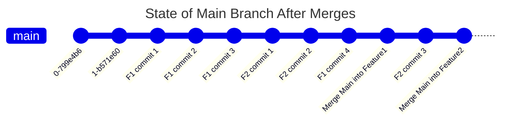
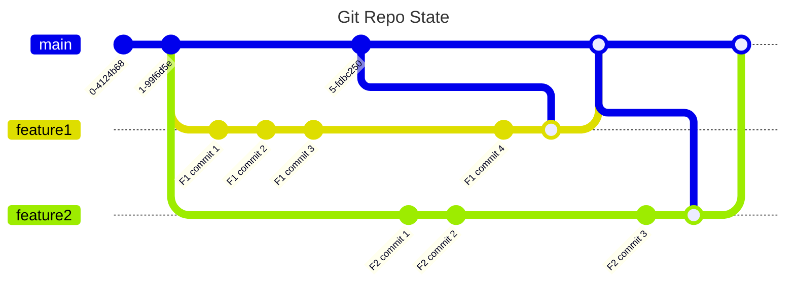
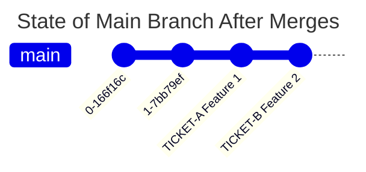

# Merge vs Merge + Squash

A simple way to think about this is that squash merge gives you just the file changes, and a regular merge gives you the file changes and the commit history.

More Reading: https://learn.microsoft.com/en-us/azure/devops/repos/git/merging-with-squash?view=azure-devops

# Merge

## What's the Problem?

After merging, the main branch is polluted with many commits that were made while the feature branch was in-progress, and often represent an unusable, broken state of the codebase.

For example, "F2 commit 2" could be a commit that includes a logical error that produces frequent crashes, which is resolved in "F2 commit 3". In this case, "F2 commit 2" should not and will likely never be used when branching off of the main branch or reverting code to a previous state.

# Merge + Squash

## Advantages of Using Merge + Squash

Now, the main branch is not polluted with commits where the branch is in a broken or unusable state. You can clearly see the progression of complete feature work. 

As well, if you need to review the code that went into a particular feature, you can easily trace all of the associated changes to one place.

If you need to remove/roll-back a feature, it's much easier to "undo" or move back the history before a single feature.

And if you're using a ticket tracking system (which you absolutely will at a job) then you can quickly identify which ticket a group of changes (feature branch) belong to.